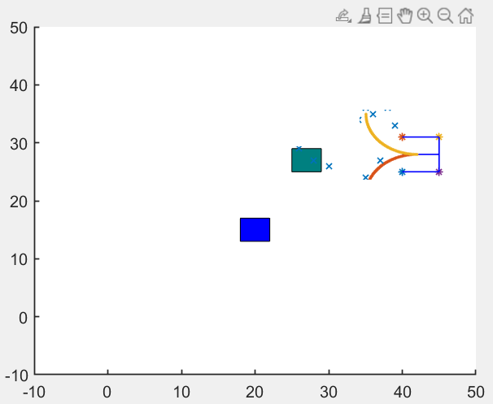

# Path Planning(RRT*) and Motion control - Furbot
This is a repository for the project named Path planning and motion control(trajectory tracking).
This project is a part of Theis , Robotics Engineering, during my master's at the University of Genova, Italy.

## Software Requirement 

Matlab 2021

# Map Definition
We already provide a sample map creating in RRTFurbot.m source code. We defined all closed polygon in that maps which shows the obstacles.
In the sample map, there are 2 different obstacles whose edges are defined by given x and y coordinates.
One sample is shown by followings;

X_max=40
y_max=40
the above is the size of the map.

The Obstacle are defined by:
Obstacle=[25,25,4,4]
Obstacle1=[10,30,4,4]

    
  

We have defined the parking positon or Goal position, Parking Slot has been defined and shown in the figure.

# Sampling Based Planner.

In the sampling-based method, We have to generate points on the map which fall on the empty region of the map.
Then we calculate which node has a connection to which nodes.  In this way, we obtain the undirected graph of generated random points.
Random Nodes generated, the Max number of nodes is defined,and the obstacle free path is generated  untill the max number of nodes is generated.
